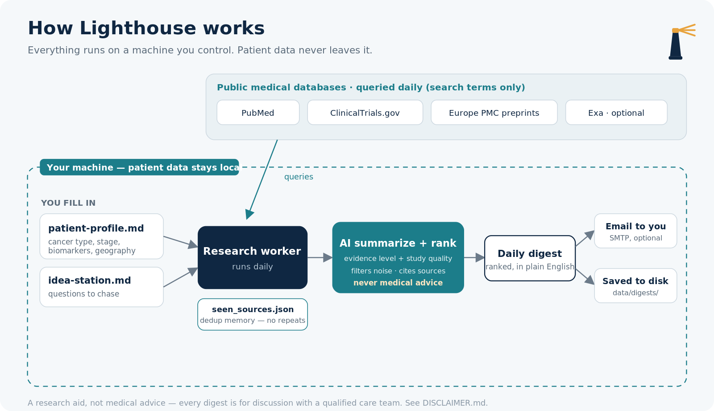
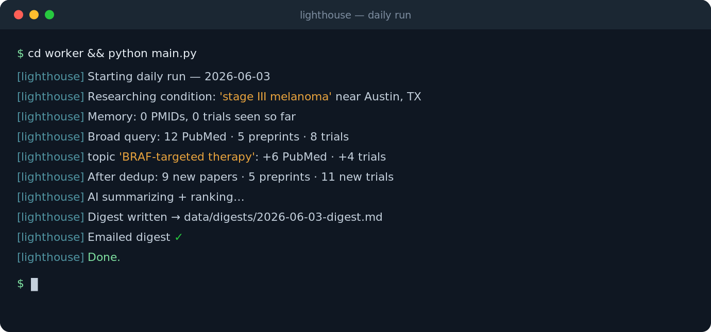
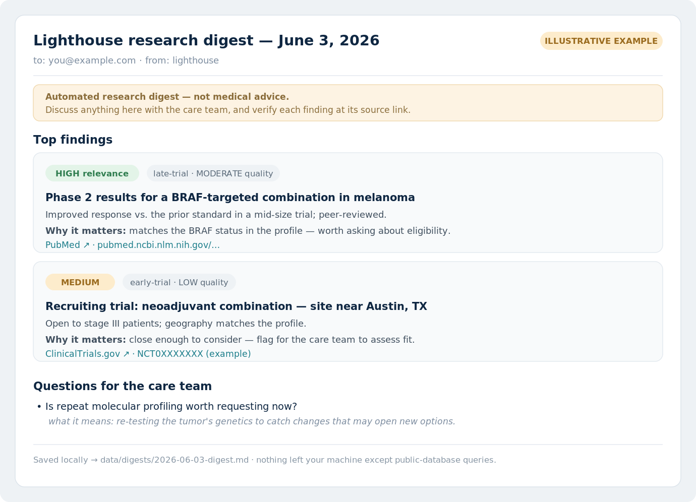

# Lighthouse

**A daily research companion for cancer patients and their caregivers.**

Lighthouse is a small, private tool that reads a profile of one person's cancer diagnosis and, every day, searches the medical literature and clinical-trial registries for findings that match. It uses AI to summarize and rank what it finds, then sends you a short digest — so the people caring for someone with cancer spend less time hunting through PubMed at 2 a.m. and more time with the person they love.

It runs on your own machine or server. The patient's information never leaves your control.

---

> ### This is not medical advice.
> Lighthouse surfaces published research and trials for you to **discuss with a qualified care team**. It does not diagnose, treat, recommend treatments, or predict outcomes. Nothing it produces should be acted on without a doctor. See [DISCLAIMER.md](DISCLAIMER.md).

---

## Who this is for

Someone you love has been diagnosed with cancer. You've become the family researcher — reading studies, tracking down trials, trying to keep up with a field that moves faster than any one person can follow. Lighthouse is for you. It does the daily scanning so you can bring the care team better questions, not so you can replace them.

It works for **any cancer type**. You tell it the diagnosis, stage, location, and any biomarkers the care team has shared; it scopes its search to that. Nothing about it is locked to a single cancer.

## What it does

- Reads a **patient profile** you fill in (cancer type, stage, biomarkers, geography, treatment line).
- Searches **PubMed**, **ClinicalTrials.gov**, and conference/guideline sources every day.
- Uses an AI model to **summarize and rank** findings by relevance and evidence quality — and to filter out noise.
- Sends you a **daily digest** by email (or any channel you wire up), every finding linked to its source.
- Keeps a running **idea station** — open questions you want it to chase over time.

## What it does *not* do

- It does not give medical advice or tell anyone what treatment to choose.
- It does not predict prognosis, odds, or timelines.
- It does not send your data anywhere you didn't set up yourself.
- It is not a substitute for an oncologist, a second opinion, or a clinical trial coordinator.

## How it works

The whole thing is driven by two plain text files you control. Change the profile, and the next day's research changes with it.

## What it looks like

Lighthouse has no app to log into — it runs quietly on a schedule and sends you a digest. Here's a run, and an example of what lands in your inbox.

**Running it** — one command, or one scheduled job:

**The digest you receive** — ranked findings, evidence labels, source links, and questions for the care team. *(Illustrative example below — the content is a sample, not real medical findings.)*

## Quick start

There are three ways to stand this up. Pick the one that fits you.

**1. With an AI assistant (easiest — no coding).**
Open this folder in an AI coding tool — Claude Cowork, Claude Code, Cursor, or VS Code with an AI extension. The tool will read [`AGENTS.md`](AGENTS.md) and walk you through setup: it asks about the diagnosis, fills in your profile, helps you add your API keys, and gets the daily job running. This is the path we used ourselves. See [SETUP.md](SETUP.md#path-a--with-an-ai-assistant).

**2. By hand (for the DIY crowd).**
Copy the profile template, add your keys to a config file, and run the worker on a schedule. Full steps in [SETUP.md](SETUP.md#path-b--by-hand).

**3. Just try one run first.**
Fill in the profile, run the worker once, and read the digest before you automate anything. Details in [SETUP.md](SETUP.md#path-c--one-run-first).

## Your data stays yours

Lighthouse is built so the patient's information lives **only where you put it** — your laptop, your server. The code in this repository contains no patient data, and the setup is designed to keep it that way: the profile and digests are kept out of version control by default (see [`.gitignore`](.gitignore)). The only thing that leaves your machine is the search queries to public medical databases and the text sent to whichever AI model you choose to summarize results. Read [DISCLAIMER.md](DISCLAIMER.md#privacy) for the full picture before you add anyone's real information.

## What you'll need

- An API key for an AI model (the default setup uses Anthropic's Claude; you can swap in another).
- Free access to PubMed and ClinicalTrials.gov (no key required; an optional free NCBI key raises rate limits).
- A way to run a da